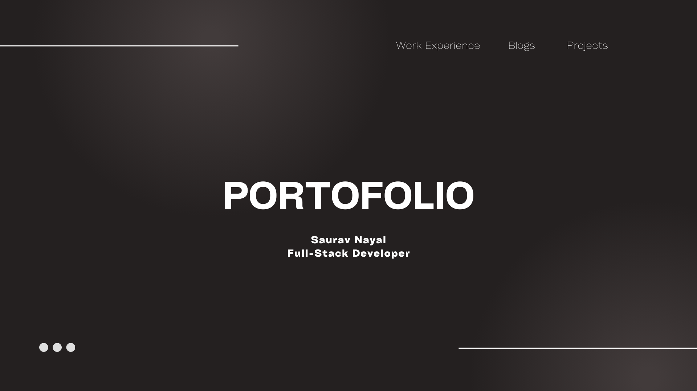

# Saurav Nayal | Portfolio

Welcome to my personal portfolio website, built with modern web technologies to showcase my skills, projects, and professional journey. This project is a reflection of my passion for building scalable, high-performance, and beautiful web applications.



## 🚀 Tech Stack

This project is built using the latest and greatest tools in the React ecosystem:

- **Framework:** [Next.js 16](https://nextjs.org/) (App Router)
- **Language:** [TypeScript](https://www.typescriptlang.org/)
- **Styling:** [Tailwind CSS 4](https://tailwindcss.com/)
- **UI Components:** [shadcn/ui](https://ui.shadcn.com/) (based on Radix UI)
- **Animations:** [Motion](https://motion.dev/) (Motion.dev)
- **Icons:** [Lucide React](https://lucide.dev/) & [Tabler Icons](https://tabler.io/icons)
- **Page Transitions:** [`next-view-transitions`](https://github.com/shuding/next-view-transitions)
- **Theming:** [`next-themes`](https://github.com/pacocoursey/next-themes)
- **Linting & Formatting:** ESLint, Prettier, Husky

## ✨ Features

- **Modern & Responsive Design:** A clean, minimal, and fully responsive interface that works flawlessly across all devices.
- **Dark/Light Mode:** Seamless theme switching with system preference detection.
- **Smooth Animations:** granular entrance animations and smooth page transitions for a premium feel.
- **SEO Optimized:** Comprehensive Open Graph tags, Twitter cards, and JSON-LD structured data for better search engine visibility.
- **Dynamic Content:** Easily configurable profile, projects, and work experience data.
- **Performance Focused:** Optimized images, fonts, and code splitting for lightning-fast load times.
- **Accessibility:** Built with accessibility in mind, using semantic HTML and accessible UI primitives.

## 🛠️ Getting Started

Follow these steps to set up the project locally on your machine.

### Prerequisites

Ensure you have the following installed:

- [Node.js](https://nodejs.org/) (v18 or higher recommended)
- [npm](https://www.npmjs.com/), [yarn](https://yarnpkg.com/), [pnpm](https://pnpm.io/), or [bun](https://bun.sh/)

### Installation

1. **Clone the repository:**

   ```bash
   git clone https://github.com/nayalsaurav/my-portfolio.git
   cd my-portfolio
   ```

2. **Install dependencies:**

   ```bash
   npm install
   # or
   yarn install
   # or
   pnpm install
   # or
   bun install
   ```

3. **Run the development server:**

   ```bash
   npm run dev
   # or
   yarn dev
   # or
   pnpm dev
   # or
   bun dev
   ```

4. **Open your browser:**
   Open [http://localhost:3000](http://localhost:3000) to view the application.

## 📂 Project Structure

```bash
├── app/                  # Application source code (Next.js App Router)
│   ├── about/            # About page
│   ├── projects/         # Projects page
│   ├── work/             # Work experience page
│   ├── globals.css       # Global styles
│   ├── layout.tsx        # Root layout
│   └── page.tsx          # Home page
├── components/           # Reusable UI components
├── config/               # Configuration files (profile data, schema, etc.)
│   └── profile.ts        # Centralized profile data
├── public/               # Static assets (images, icons)
├── lib/                  # Utility functions
└── ...
```

## 🎨 Customization

The portfolio is designed to be easily customizable. You can update your personal information, skills, projects, and work experience by modifying the files in the `config/` directory.

- **`config/profile.ts`**: Contains your bio, contact info, skills, experience, and project data.
- **`config/schema.ts`**: Defines the structured data for SEO.

## 🚀 Deployment

The easiest way to deploy this Next.js app is to use the [Vercel Platform](https://vercel.com/new).

1. Push your code to a GitHub repository.
2. Import the project into Vercel.
3. Vercel will automatically detect the settings and deploy your site.

## 📄 License

This project is licensed under the MIT License - see the [LICENSE](LICENSE) file for details.

## 📬 Contact

**Saurav Nayal**

- Website: [https://www.nayalsaurav.in](https://www.nayalsaurav.in)
- GitHub: [@nayalsaurav](https://github.com/nayalsaurav)
- LinkedIn: [Saurav Nayal](https://www.linkedin.com/in/nayalsaurav/)
- Twitter: [@nayalsaurav](https://twitter.com/nayalsaurav)
- Email: [nayalsaurav@gmail.com](mailto:nayalsaurav@gmail.com)
